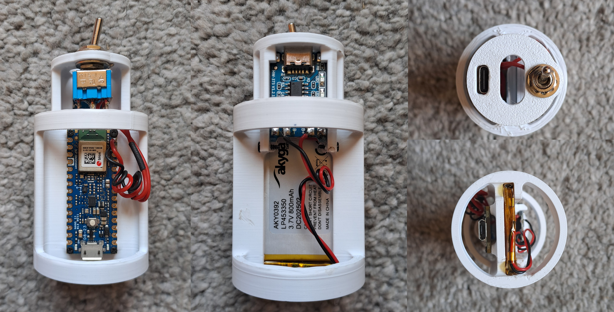

# Digiball — Production Guide

**Version:** 2.1  

**Github:** [github.com/Digitopia/Digiball_2.0](https://github.com/Digitopia/Digiball_2.0)
**Website:** [digitopia.casadamusica.com/Digiball_2.0](https://digitopia.casadamusica.com/Digiball_2.0/)

---

## Overview

The Digiball is a 3D-printed ball containing an Arduino Nano 33 BLE Rev2 with an IMU (Inertial Measurement Unit). It connects wirelessly via Bluetooth Low Energy (BLE) to a website that translates the ball's movement into sound in real time.

This guide walks through every step needed to build one unit from scratch: printing the parts, assembling and soldering the electronics, calibrating the sensors, uploading the software and testing the instrument


### What you will build

| Part                                  | Material | File                                        |
| ------------------------------------- | -------- | ------------------------------------------- |
| Ball body                             | TPU 95A  | 3D Printing / PRINT_body.3mf                |
| Cover (lid)                           | TPU 95A  | 3D Printing / PRINT_cover.3mf               |
| Hold Cap                              | TPU 95A  | 3D Printing / PRINT_holdCap.3mf             |
| Electronics Cylinder                  | PLA+     | 3D Printing / PRINT_electronicsCylinder.3mf |
| Arduino with battery charging circuit |          |                                             |


### What you will need

#### Components

| Component                                  | Quantity  | Link                                                                                                                                                                                                                                                                                     | Comment                                                                                                                        |
| ------------------------------------------ | --------- | ---------------------------------------------------------------------------------------------------------------------------------------------------------------------------------------------------------------------------------------------------------------------------------------- | ------------------------------------------------------------------------------------------------------------------------------ |
| Arduino Nano 33 BLE Rev2                   | 1         | https://mauser.pt/095-3362/arduino-abx00071-microcontrolador-arduino-nano-33-ble-rev2                                                                                                                                                                                                    |                                                                                                                                |
| LiPo battery                               | 1         | https://mauser.pt/035-5288/bateria-3-7v-800mah-li-po-33x50x4-5mm                                                                                                                                                                                                                         | Even though you can select other batteries, the measurments of the electronics cylinder are made to fit this specific battery. |
| LiPo charging circuit (e.g. TP4056 module) | 1         | https://mauser.pt/095-2041/modulo-carregador-de-bateria-li-ion-1a-entrada-usb-c-c-output                                                                                                                                                                                                 |                                                                                                                                |
| Toggle Switch ON - ON                      | 1         | https://mauser.pt/010-0084/ninigi-tsm102a1-interruptor-de-alavanca-miniatura-2-posicoes-estaveis-on-on-250vac-3a-3-pinos-preto                                                                                                                                                           |                                                                                                                                |
| Jumper wire / silicone wire (thin gauge)   | ~30 cm    | https://mauser.pt/016-0149/goobay-rolo-de-fio-de-cobre-multifilar-1-1mm-1x0-14mm-vermelho-10m e [https://mauser.pt/016-0150/goobay-rolo-de-fio-de-cobre-multifilar-1-1mm-1x0-14mm-preto-10m](https://mauser.pt/016-0150/goobay-rolo-de-fio-de-cobre-multifilar-1-1mm-1x0-14mm-preto-10m) |                                                                                                                                |
| Heat shrink tubing or electrical tape      | as needed |                                                                                                                                                                                                                                                                                          |                                                                                                                                |
| M1.6 x L 3mm bolts                         | 4         | https://mauser.pt/091-0991/bossard-1243683-parafuso-de-inox-m1-6x3mm-fenda                                                                                                                                                                                                               | For fixing the Arduino to the cylinder                                                                                         |
| M1.6 x L 6mm bolt                          | 2         | https://mauser.pt/092-0002/bossard-1945130-parafuso-de-aco-zincado-m1-6x6mm-phillips-ph2                                                                                                                                                                                                 | For fixing the battery charging board                                                                                          |
| M2x25mm bolt                               | 2         |                                                                                                                                                                                                                                                                                          | For fastening the cover and the hold cap                                                                                       |
| M2 nut                                     | 2         |                                                                                                                                                                                                                                                                                          | For fastening the cover and the hold cap                                                                                       |
| M2 washers                                 | 4         |                                                                                                                                                                                                                                                                                          | For fastening the cover and the hold cap                                                                                       |


#### Tools

- 3D Printer that is able to print in TPU

- Soldering iron, solder, flux, dessoldering pump 

- Set of screwdrivers matching the bolts you buy

- Smal needle nose pliers or similar.
  
   

### Repository structure

The files used in the production of this project can be found in the following folders:

```
Digiball_2.0/
├── Arduino/        ← Arduino sketches for calibrating and running the instrument
├── 3D Printing/    ← files to print the different parts of the ball           
└── ...
```


---

## 

## Phase 1 — Software preparation

### 1.1 Install Arduino IDE 2

1. Go to [arduino.cc/en/software](https://www.arduino.cc/en/software) and download **Arduino IDE** for your operating system (Windows, macOS, or Linux).
2. Run the installer and follow the on-screen instructions.
3. Open Arduino IDE 2 to confirm it launches correctly.

Alternatively you can also use the [Arduino Cloud Editor](https://app.arduino.cc/sketches?custom_banner=cloud_banner), which doesn't require installation but requires a signup / login. This tutorial was made using the Arduino IDE installed locally. Steps may differ in the Arduino Cloud Editor.

### 

### 1.2 Add the Arduino Nano 33 BLE Rev2 board

1. In Arduino IDE, open **File → Preferences** (or **Arduino IDE → Settings** on macOS).
2. Go to **Tools → Board → Boards Manager**.
3. Search for `Arduino Mbed OS Nano Boards` and install it. This package includes the Nano 33 BLE Rev2. The download is large (~250 MB);

### 

### 1.3 Install the required libraries

Go to **Tools → Manage Libraries** and install each of the following (search by name, install the latest version):

| Library                 | Author            |
| ----------------------- | ----------------- |
| `ArduinoBLE`            | Arduino           |
| `Arduino_BMI270_BMM150` | Arduino           |
| `ReefwingAHRS`          | Reefwing Software |
| `SensorFusion`          | Romain JL         |

> **Note:** When installing `ReefwingAHRS`, the IDE may ask if you want to install its dependencies automatically. Click **Install All**.


### 1.4 Confirm Google Chrome is available

The Digiball website uses the **Web Bluetooth API**, which is only supported by **Google Chrome** (and Chromium-based browsers). Make sure Chrome is installed on the computer you will use for testing.


---

## 

## Phase 2 — 3D Printing

The Digiball is made of four printed parts, as shown in the image at the start of this guide. The ball body, lid and hold cap are to be printed in a flexible filament (TPU), while the electronics cylinder should be printed in a rigid filament (PLA+).

> **Print the TPU and PLA parts separately** — they require different filaments, temperatures, and print profiles.


### 2.1 Printer and profiles

3MF files containing each part with it's respective printing profile cand be found in this repository. The files are identified with the prefix PRINT. The files can be imported directly to most slicer software and printed. Instructions for operating each specific slicer software or printer can be found in the websites of their respective makers.

Under normal operation (the printer having been calibrated and having filament loaded) the process usually involves importing the 3MF file to the slicer software, slicing it and sending it for printing.

If you want to manually check the profiles, below are the settings used for the different parts.


### 2.2 TPU parts — `body` , `cover` and `hold cap`

**Filament:** TPU 95A (e.g. eSUN ePTU-95A or equivalent)

| Setting            | Value                         |
| ------------------ | ----------------------------- |
| Layer height       | 0.2 mm                        |
| Wall loops         | 4                             |
| Infill density     | 3%                            |
| Infill pattern     | Gyroid                        |
| Supports           | Tree (auto), build plate only |
| Brim               | Auto, 5 mm                    |
| Nozzle temperature | 220 °C (first layer: 225 °C)  |
| Bed temperature    | 55 °C (Textured PEI plate)    |
| Print speed        | 30 mm/s (all)                 |
| Cooling fan        | 50–80%                        |

> **TPU tips:**
> 
> - TPU is flexible and sticky. Slow print speeds are essential to avoid jams and stringing.
> - Dry your filament before printing if it has been exposed to humidity for more than a few days. Wet TPU produces bubbles and weak layers.
> - Do not use a smooth PEI plate — textured PEI gives better first layer adhesion with TPU.
> - Do not print TPU too fast. If in doubt, stay at 25–30 mm/s throughout.

### 

### 2.3 PLA+ parts — `electronics cylinder`

**Filament:** PLA+ (e.g. eSUN ePLA+ or equivalent)

| Setting            | Value                      |
| ------------------ | -------------------------- |
| Layer height       | 0.2 mm                     |
| Wall loops         | 6                          |
| Infill density     | 35%                        |
| Infill pattern     | Gyroid                     |
| Supports           | Tree (auto)                |
| Brim               | Auto, 5 mm                 |
| Nozzle temperature | 220 °C                     |
| Bed temperature    | 55 °C (Textured PEI plate) |
| Outer wall speed   | 60 mm/s                    |
| Cooling fan        | 100%                       |

> **PLA+ tips:**
> 
> - The cylinder needs to be dimensionally accurate for the electronics to fit and the enclosure to close properly. Do not rush the print.


### 2.4 Estimated print times

<!-- TODO: fill in actual print times from Bambu Studio once confirmed -->

| Part                   | Material | Estimated time |
| ---------------------- | -------- | -------------- |
| `corpo`                | TPU      | ~29 h          |
| `tampa`                | TPU      | ~3h30          |
| `cilindroElectronicas` | PLA+     | ~1h45          |
| `encaixe`              | PLA+     | ~2h30 h        |

---

## Phase 3 — Electronics assembly

> **Safety note:** This phase involves soldering. Work in a ventilated area, use a stand to hold the iron, and never touch the tip. 

<!-- TODO: add exact battery capacity and dimensions, exact charging module used, confirm switch type -->

### 

### Circuit Wiring

The wiring should be done according to the following diagram.


### Soldering and assembly into the cylinder

1) Pre-fit the components into the cylinder, following the images below. Measure the aproximate distances between the sodering points in the circuit for calculating the length of the cables to use. Cut the cables a lot longer than these measurments, as you will need the length to be able fit the components in the final assembly.  We would advise to follow the cable colouring in the scheme, as it will make it harder to have a mistake and switch the ground with the positive parts of the circuit.
   
   
   
   
   
   

2) Soder every component - but the arduino - according to the circuit at the beginning of this section. 

3) Fit the components to their respective places, passing the toggle switch through the hole in the cylinder, as shown in the image below
   
   

4) Fix the toggle switch by using it's nut and washers, the battery by sliding it into it's slot and the battery recharging unit by sliding it into it's slot and screwing 2 bolts at it's end, to prevent it from sliding out.

5) Solder the 2 remaining cables (one coming from the switch and the other from the battery) to the Vin positive and ground pins of the arduino, as shown in the diagram. Make sure the circuit is in it's correct configuration, as switching the positive and ground wires might damage the arduino. 

6) Finally, mount the arduino to the cylinder by using 4 screws.
   
   

<!-- TODO: describe how components are physically arranged inside the cylinder — Arduino orientation, battery placement, securing method (foam, adhesive, etc.) -->

---


## Phase 4 — Sensor calibration

Each physical unit needs its own calibration, because small manufacturing variations in the IMU sensors (gyroscope and magnetometer) produce unit-specific offsets. You will run three calibration sketches, note the output values, and insert them into the run sketch before uploading.

> **Important:** The Arduino must be connected to your computer via USB cable during this entire phase. The calibration sketches communicate via the Serial Monitor.


### 4.1 Gyroscope calibration

**Goal:** Find the zero-rate offset — the small drift each gyroscope axis reads even when perfectly still.

**Steps:**

1. Open `Arduino/CALIB_digiball_arduino_nano_ble_gyro_calib/CALIB_digiball_arduino_nano_ble_gyro_calib.ino` in Arduino IDE.

2. Connect the Arduino Nano 33 BLE Rev2 via USB.

3. Select the correct board: **Tools → Board → Arduino Mbed OS Nano Boards → Arduino Nano 33 BLE**.

4. Select the correct port: **Tools → Port → [your Arduino port]**.

5. Open the Serial Monitor: **Tools → Serial Monitor** (or Ctrl+Shift+M). Set baud rate to **115200**.

6. Place the Arduino — or the assembled cylinder — on a **flat, stable surface where it will not move at all**.

7. Upload the sketch (→ button or Ctrl+U).

8. The sketch will count down and then collect 1000 samples. Do not touch or move the unit during this time.

9. When it finishes, the Serial Monitor will print a final line:
   
   ```
   Final zero rate offset in radians/s:
   X, Y, Z
   ```

10. **Write down these three values.** You will need them in Phase 4.3.


### 4.2 Magnetometer hard iron calibration

**Goal:** Correct for static magnetic interference from the electronics themselves (the "hard iron" effect).

**Steps:**

1. Open `Arduino/CALIB_digiball_arduino_nano_ble_mag_hard_iron_calib/CALIB_digiball_arduino_nano_ble_mag_hard_iron_calib.ino`.
2. Upload it to the Arduino (same board and port as before).
3. Open the Serial Monitor (baud rate **115200**).
4. **Slowly rotate the ball in every possible direction** — think of trying to point every face of an imaginary cube in turn. Keep rotating for at least 60 seconds, covering all orientations.
5. Watch the *Hard offset* values in the Serial Monitor. They will stabilise as you cover more orientations. When the values stop changing significantly, stop rotating.
6. **Write down the three Hard offset values** (X, Y, Z). You will need them in Phase 4.3.

> **Note:** There is an optional third calibration for soft iron correction using MotionCal software (`CALIB_digiball_arduino_nano_ble_calib_mag_soft_iron_motioncal.ino`). This gives more precise results but requires downloading [MotionCal](https://www.pjrc.com/store/prop_shield.html). It is not required for the instrument to work well; the hard iron calibration is sufficient for most use cases. See Appendix A if you want to do this step.


### 4.3 Insert calibration values into the RUN sketch

1. Open `Arduino/RUN_digiball_arduino_nano_ble_6_reefwing_mahony/RUN_digiball_arduino_nano_ble_6_reefwing_mahony.ino`.

2. Near the top of the file, find these three constant definitions:
   
   ```cpp
   // values for hard and soft iron correction of the magnetometer
   const float hard_iron[3] = { -30.13, 20.95, -20.51 };
   
   const float soft_iron[3][3]{ { 0.000, 0.000, 0.000 },
                                { 0.000, 0.000, 0.000 },
                                { 0.000, 0.000, 0.000 } };
   
   // values for the correction of the gyroscope and accelerometer
   const float gyro_offset[3] = { -0.2747, -0.1221, 0.0610 };
   ```

3. Replace the three values in `hard_iron[3]` with your **Hard offset** values from Phase 4.2 (in the same X, Y, Z order).

4. Replace the three values in `gyro_offset[3]` with your **zero rate offset** values from Phase 4.1 (in the same X, Y, Z order).

5. Leave `soft_iron` unchanged for now (the default matrix is the identity matrix and is fine unless you did the soft iron calibration in Appendix A).

6. **Save the file** (Ctrl+S). Do not change anything else.

> **Keep a record.** Write your calibration values somewhere safe (a text file, a notebook) — if you ever need to re-upload the firmware, you will need them again and it is faster than re-calibrating.
> 
> **Make sure to correctly insert negative numbers with their sign (-) when they exist.**


---


## Phase 5 — Upload the firmware and test

### 5.1 Upload the RUN sketch

1. With the RUN sketch open and your calibration values saved into it, upload it to the Arduino (→ button or Ctrl+U).

2. Open the Serial Monitor (baud rate **115200**) to confirm the Arduino starts up correctly. You should see messages like:
   
   ```
   BMI270 & BMM150 IMUs Connected.
   Bluetooth device active, waiting for connections...
   ```
   
   If you see `BMI270 & BMM150 IMUs Not Detected.` or nothing at all, check your wiring and that the board is powered correctly.
   
   

### 5.2 Test the BLE connection and sound

> **Do this before closing the ball** — it is much easier to fix problems now.

1. Power the Arduino (via USB cable or battery, with the switch on).
2. On a computer, open **Google Chrome** and go to:
   **[https://digitopia.casadamusica.com/Digiball_2.0/](https://digitopia.casadamusica.com/Digiball_2.0/)**
3. Click the **Connect** button on the website.
4. A browser dialog will appear listing available Bluetooth devices. Select **Digiball** from the list and click *Pair* or *Connect*.
5. Move the ball/Arduino around. You should hear sound responding to the movement.

> **Troubleshooting if "Digiball" does not appear in the list:**
> 
> - Make sure the Arduino is powered and the RUN sketch is uploaded.
> - Make sure your computer's Bluetooth is switched on. You should not try to pair the arduino in the computer settings
> - Make sure you are using Google Chrome (not Firefox, Safari, or Edge).
> - Try refreshing the page and clicking Connect again.
> - If you still cannot connect, connect the Arduino to te computer, via USB, open the Serial Monitor and watch for any error messages


---


## Phase 6 —  Assembly

> Once you are satisfied that the electronics work correctly (Phase 5), you can close the ball.

1. Ensure all wires are routed neatly inside the cylinder and none will be pinched when closing.
2. Insert the electronics cylinder into the ball body, aligning the USB port and switch with the opening on the cylinder.
   
   
   
   
   
   
3. Assemble the cover and the hold cap by using 2 bolts, 4 washers (one on each side of the contact with the printed parts) and 2 nuts. 
   
   
   
   
   
   
4. Press the assembled cover into place and rotate counter clockwise to secure the cylinder.

---

## Phase 7 — Final test

With the ball fully assembled:

1. Switch the ball on using the button on the cylinder.
2. Open Chrome and go to [digitopia.casadamusica.com/Digiball_2.0/](https://digitopia.casadamusica.com/Digiball_2.0/).
3. Click Connect, select **Digiball**, and connect.
4. Play. Move the ball in your hands, throw it gently, roll it, tilt it — the sound should respond to the movement.
5. To switch off, use the on/off button. The BLE connection will drop and the website will show it as disconnected.

---

## Appendix A — Optional: Soft iron magnetometer calibration

The soft iron calibration corrects for more subtle magnetic distortions. It requires the external **MotionCal** application.

1. Download MotionCal from [pjrc.com/store/prop_shield.html](https://www.pjrc.com/store/prop_shield.html).
2. Upload the sketch `CALIB_digiball_arduino_nano_ble_calib_mag_soft_iron_motioncal.ino` to the Arduino.
3. Open MotionCal and select the Arduino's serial port. Make shure that the Serial Monitor in the Arduino IDE is closed. If it is open (at the bottom of the window), the arduino will not be able to connect to MotionCal.
4. Slowly rotate the ball through all orientations until the visualisation shows even coverage of the sphere.
5. MotionCal will compute a 3×3 soft iron matrix and a hard iron offset vector. Note both.
6. In the RUN sketch, replace both the `hard_iron[3]` values and the `soft_iron[3][3]` matrix with the values from MotionCal.


---


## Appendix B — Optional: Running the website locally

If you want to run the Digiball website on your own computer (for offline use or development):

1. Make sure you have **Python 3** installed. Open a terminal and run `python3 --version` to confirm.

2. Clone or download this repository to your computer.

3. In the terminal, navigate to the repository root folder:
   
   ```
   cd path/to/Digiball_2.0
   ```

4. Start a local web server:
   
   ```
   python3 -m http.server
   ```

5. Open Google Chrome and go to `http://localhost:8000`.

6. The site should work exactly as the hosted version.


---


## Appendix C — Troubleshooting

| Symptom                                  | Likely cause                                      | What to try                                                                                       |
| ---------------------------------------- | ------------------------------------------------- | ------------------------------------------------------------------------------------------------- |
| Arduino IDE does not recognise the board | Wrong board selected or driver issue              | Check Tools → Board is set to *Arduino Nano 33 BLE*. On Windows, try reinstalling the USB driver. |
| Sketch fails to compile                  | Missing library                                   | Check all four libraries are installed (Section 1.3).                                             |
| Serial Monitor shows `IMUs Not Detected` | Wiring issue                                      | Check all solder joints and wiring from the IMU to the Arduino.                                   |
| BLE device not visible in Chrome         | Arduino not in advertising mode, or Bluetooth off | Re-upload RUN sketch; check computer Bluetooth; use Chrome only.                                  |
| Sound responds erractically              | Calibration values incorrect                      | Repeat Phase 4 with the correct unit.                                                             |
| Ball makes sound even when still         | Calibration values incorrect                      | Repeat Phase 4 with the correct unit.                                                             |
| Website does not open                    | Internet connection, or wrong browser             | Use Chrome; check internet connection; try the local server in Appendix B.                        |


---


*Digiball is a project by [Digitopia](https://digitopia.casadamusica.com) at Casa da Música, Porto.*
